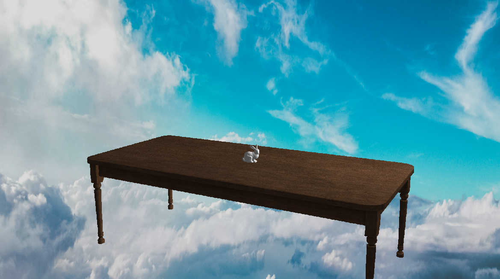

# Rasterboy

A software rasterizer written in Rust completely from scratch; The only dependency is `std`. It can load OBJ meshes, render with phong lighting, and apply texutres to models with bilinear filtering. Scenes can be specified in a custom XML format. The following image was rendered with rasterboy:

